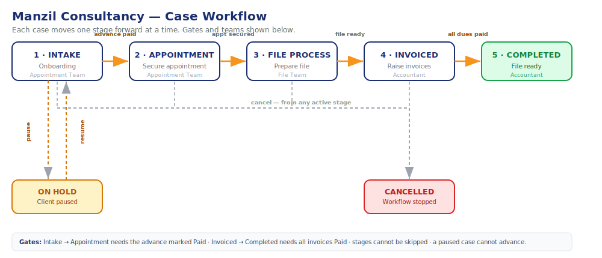
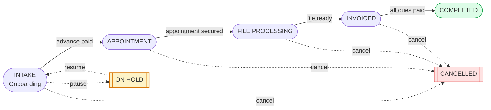

# Manzil Consultancy — Case Workflow

How a client's visa application moves through the system, who handles each step, and
the rules that keep the process in order.

---

## 1. The teams

Each operational role only sees and acts on the part of the process it owns
(separation of duties). Managers and admins can act across all stages.

| Role | Responsibility |
|------|----------------|
| **Appointment Team** | Onboarding details, advance payment, securing the appointment |
| **File Team** | Collecting remaining info, arranging travel, preparing documents |
| **Accountant** | Invoices, recording dues status, completing the case |
| **HR Manager / Admin / Super Admin** | Oversight — can act on every stage |

---

## 2. The flow at a glance

*The same flow as a Mermaid diagram (renders on GitHub / Markdown viewers):*

A case always moves **one stage forward at a time** — stages can never be skipped.

---

## 3. Step by step

### Stage 1 — Intake (Onboarding) · *Appointment Team*
The client is onboarded with their essential details:
- Passport number, full name, date of birth
- Destination country and preferred appointment city
- Service charges and the **advance amount**

The advance payment is recorded and marked **Paid / Unpaid**. An **Advance Receipt**
(PDF) can be downloaded once it is marked Paid.

➡️ **Gate:** the case cannot leave Intake until the advance is marked **Paid**.

> The client may **pause** the process at this step (e.g. they are travelling or
> undecided). A paused case is put **On Hold** and cannot advance until it is resumed.

### Stage 2 — Appointment · *Appointment Team*
The Appointment Team works to secure the visa appointment and records:
- Appointment date, FRA number, TLS account, notes
- The client may still change destination country or city at this point

The case is **assigned to an Appointment Team member** so ownership is clear.

➡️ Once the appointment is secured, the case advances to File Processing.

### Stage 3 — File Processing · *File Team*
The case is **assigned to a File Team member**, who collects the remaining
information and prepares the file:
- Current address, marital status, email
- Travel history and previous Schengen visa details
- Arranging flight tickets, hotel reservation, travel insurance
- Document checklist: appointment docs, ticket, insurance, hotel, e-visa, SOP, visa form

➡️ When the file is ready, the case advances to Invoiced.

### Stage 4 — Invoiced · *Accountant*
The Accountant raises one or more **invoices** for the case. Payment itself is handled
**manually outside the system** — here we only track each invoice's **status**
(Draft → Sent → Partial → Paid). An **Invoice Receipt** (PDF) can be downloaded for any
invoice.

➡️ **Gate:** the case cannot be completed until **every invoice is marked Paid**.

### Stage 5 — Completed · *Accountant*
With all dues cleared, the Accountant marks the case **Completed**. The full file is
ready to be shared with the client.

---

## 4. The rules that keep it in order

| Rule | What it enforces |
|------|------------------|
| **No skipping** | A case moves exactly one stage forward at a time |
| **Advance gate** | Intake → Appointment is blocked until the advance is marked Paid |
| **Dues gate** | Invoiced → Completed is blocked until all invoices are Paid |
| **Pause** | An On-Hold case cannot advance until it is resumed |
| **Cancel** | A case can be cancelled from any active stage (stops the workflow) |
| **Terminal** | Completed and Cancelled cases cannot change stage |

These rules are enforced on the server, so they hold no matter who calls the API.

---

## 5. Who can move each stage

Each transition requires a specific permission, so only the right team can perform it.

| Transition | Required permission | Performed by |
|------------|--------------------|--------------|
| Intake → Appointment | `appointments:write` | Appointment Team |
| Appointment → File Processing | `files:write` | File Team |
| File Processing → Invoiced | `files:write` or `invoices:write` | File Team / Accountant |
| Invoiced → Completed | `invoices:write` | Accountant |
| Any → Cancelled | `clients:write` | Manager / Admin |

Managers, Admins and the Super Admin hold the relevant permissions and can act on every stage.

---

## 6. Documents (PDF)

| Document | Where | Available when |
|----------|-------|----------------|
| **Advance Receipt** | Case → Onboarding section | Advance marked Paid |
| **Invoice Receipt** | Invoices list / Case → Invoices | Any invoice (switches to "Receipt" once Paid) |
| **Client Profile** | Client detail → Download PDF | Any time |

---

## 7. Quick reference

**Stages:** `INTAKE → APPOINTMENT → FILE_PROCESSING → INVOICED → COMPLETED`
(plus `CANCELLED`, and an `On Hold` pause flag)

**Login accounts (demo):**

| Role | Email | Password |
|------|-------|----------|
| Super Admin | admin@manzil.com | Admin@123456 |
| HR Manager | manager@manzil.com | Team@123456 |
| Appointment Team | appointment@manzil.com | Team@123456 |
| File Team | files@manzil.com | Team@123456 |
| Accountant | accounts@manzil.com | Team@123456 |
